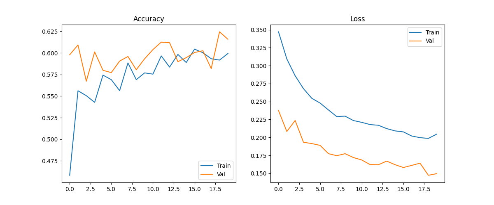
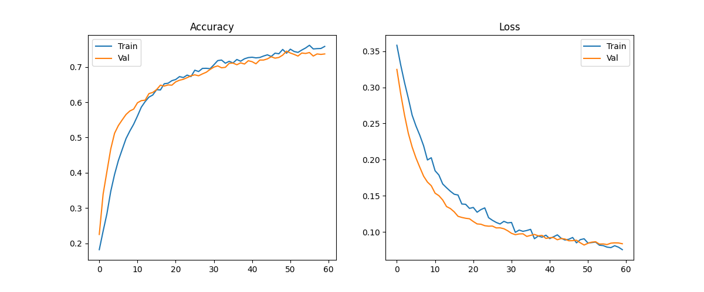

# 🩺 Skin-Cancer-EfficientNet  
### Clasificador Dermatológico con Deep Learning

**Autor:** Juan David Raigoso Espinosa  
**Profesión:** Economista · Científico de Datos  
📧 **Email:** jraigosoespinosa@gmail.com  

---

## 🌍 Contexto del Proyecto

El **cáncer de piel** es una de las enfermedades más comunes a nivel mundial.  
Una **detección temprana** puede aumentar significativamente la supervivencia y mejorar los resultados clínicos.

Este proyecto implementa un **pipeline completo de Deep Learning aplicado a dermatología computacional**, replicando el funcionamiento de herramientas reales usadas en entornos clínicos y de investigación.

El sistema incluye:

- Entrenamiento de **CNN avanzadas (EfficientNet B0 → B4 con Fine-Tuning profundo)**
- Técnicas modernas de **visión por computador**
- **Tracking de experimentos con MLflow**
- Evaluación e interpretabilidad clínica mediante **Grad-CAM**
- **Aplicación Web profesional en Streamlit**

🎯 **Objetivo:**  
Clasificar **lesiones cutáneas en 7 categorías clínicas** a partir de imágenes dermatoscópicas.

---

## 📊 Dataset — HAM10000

**Fuente oficial:**  
🔗 https://www.kaggle.com/datasets/kmader/skin-cancer-mnist-ham10000

**Descripción general:**

- 10,015 imágenes dermatoscópicas
- 7 clases clínicas de lesiones cutáneas

| Clase | Descripción |
|------|------------|
| akiec | Lesión precancerosa (queratosis actínica / enfermedad de Bowen) |
| bcc | Carcinoma basocelular |
| bkl | Queratosis benigna |
| df | Dermatofibroma |
| mel | Melanoma maligno |
| nv | Nevus melanocítico (lunar benigno) |
| vasc | Lesiones vasculares |

---

## 🧹 Preprocesamiento & Data Engineering

- **Redimensionamiento:** `380 × 380 px`
- **Normalización:** `[0 – 1]`
- **Split estratificado:**
  - Train: 70%
  - Validation: 15%
  - Test: 15%

### Aumento de Datos (Data Augmentation)

- Flip horizontal y vertical  
- Rotaciones  
- Zoom  
- Random Brightness  
- Random Contrast  

### Técnicas avanzadas
- **MixUp**
- **CutMix**

---

## 🧠 Arquitectura del Modelo

### Modelo Final
**EfficientNetB4** entrenado con **Transfer Learning sobre ImageNet** y Fine-Tuning profundo.

### 🔹 Etapas de Entrenamiento

#### 🟦 1. Warm-Up Training
- Backbone congelado
- 30 épocas
- Learning Rate: `1e-4`
- Entrenamiento de la capa final desde cero

#### 🟧 2. Fine-Tuning Avanzado
- Descongelado progresivo de capas superiores
- 40 épocas
- Learning Rate reducido: `3e-6`
- Regularización con **Weight Decay**

### 🛠 Infraestructura
- Google Colab Pro
- GPU **NVIDIA A100 – 80GB**
- Tiempo total de entrenamiento ≈ **4.5 horas**

---

## 🧪 Experiment Tracking — MLflow

El proyecto integra **MLflow** para trazabilidad completa:

- Registro de métricas por época
- Registro de hiperparámetros
- Almacenamiento automático de:
  - Modelos
  - Gráficas de pérdida y accuracy
  - Matriz de confusión
  - Curvas ROC por clase
  - Checkpoints

---

## 🎯 Resultados — EfficientNetB4 v1 Advanced

### 🧾 Métricas Globales

| Métrica | Valor |
|-------|-------|
| Accuracy | **0.737** |
| Macro F1 | **0.636** |
| Weighted F1 | **0.762** |

### 🔬 Métricas por Clase (resumen)

| Clase | Precision | Recall | F1 |
|------|----------|--------|----|
| akiec | 0.90 | 0.36 | 0.52 |
| bcc | 0.89 | 0.67 | 0.77 |
| bkl | 0.52 | 0.87 | 0.65 |
| df | 0.22 | 0.82 | 0.35 |
| mel | 0.38 | 0.66 | 0.49 |
| nv | 0.97 | 0.74 | 0.84 |
| vasc | 0.70 | 1.00 | 0.82 |

📌 El desempeño es **competitivo con publicaciones recientes** basadas en HAM10000.

---

## 📈 Curvas y Evaluaciones Visuales

### Warm-Up Training

### Fine-Tuning

### ROC-AUC por Clase

### Matriz de Confusión

---

## 🔥 Aplicación Web — Streamlit

La aplicación incluye:

- ✔ Subida de imagen (*drag & drop*)
- ✔ Visualización de la imagen original
- ✔ Predicción con probabilidades por clase
- ✔ Codificación visual del riesgo:
  - 🟩 Alta
  - 🟨 Media
  - 🟥 Baja
- ✔ **Grad-CAM** para interpretabilidad clínica
- ✔ Definición médica de cada clase
- ✔ Interfaz tipo **dashboard clínico** (tema oscuro, estilo laboratorio)

---

## 📂 Estructura del Proyecto

