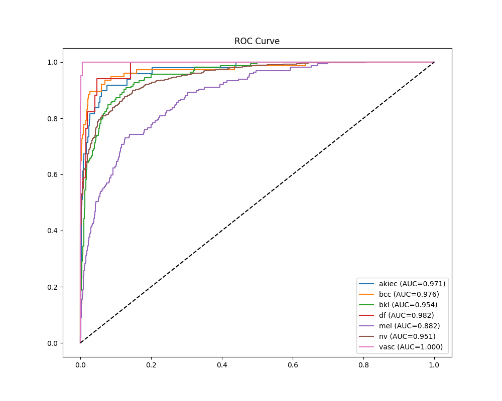
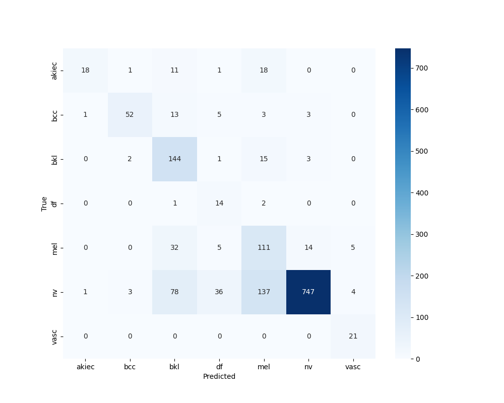

# 🧬 Clasificación de Cáncer de Piel — EfficientNetV2M (Medical V2)

## 🌍 Contexto del Proyecto

El **cáncer de piel** es una de las enfermedades más comunes a nivel mundial.  
Una **detección temprana** puede aumentar significativamente la supervivencia y mejorar los resultados clínicos.

Este proyecto implementa un **pipeline completo de Deep Learning aplicado a dermatología computacional**, replicando el funcionamiento de herramientas usadas en entornos clínicos y de investigación.

Incluye:

- Entrenamiento y *fine-tuning* de redes convolucionales avanzadas (**EfficientNetB0 → B4**) y evolución hacia **EfficientNetV2M**
- Técnicas modernas de visión por computador y regularización
- Trazabilidad experimental con **MLflow**
- Interpretabilidad clínica mediante **Grad-CAM / Grad-CAM++**
- **Aplicación Web en Streamlit** desplegada en Hugging Face Spaces

🎯 **Objetivo:** Clasificar **lesiones cutáneas en 7 categorías clínicas** a partir de imágenes dermatoscópicas.

---

## 📊 Dataset — HAM10000

**Fuente oficial:**  
🔗 https://www.kaggle.com/datasets/kmader/skin-cancer-mnist-ham10000

**Descripción general:**

- 10,015 imágenes dermatoscópicas
- 7 clases clínicas de lesiones cutáneas

| Clase | Descripción |
|------|------------|
| akiec | Lesión precancerosa (queratosis actínica / enfermedad de Bowen) |
| bcc | Carcinoma basocelular |
| bkl | Queratosis benigna |
| df | Dermatofibroma |
| mel | Melanoma maligno |
| nv | Nevus melanocítico (lunar benigno) |
| vasc | Lesiones vasculares |

---

## ⚠️ Desafíos del Proyecto — Desbalance de Clases

Uno de los principales retos técnicos de este proyecto fue el **fuerte desbalance de clases** del dataset **HAM10000**, típico en datasets médicos reales.

### 📊 Distribución de Clases

| Clase | Descripción | # Imágenes |
|------|------------|-----------|
| nv | Nevus (lunar benigno) | 6,705 |
| mel | Melanoma maligno | 1,113 |
| bkl | Queratosis benigna | 1,099 |
| bcc | Carcinoma basocelular | 514 |
| akiec | Lesión precancerosa | 327 |
| vasc | Lesiones vasculares | 142 |
| df | Dermatofibroma | 115 |

📌 La clase **nv domina el dataset**, mientras que lesiones clínicamente críticas como **melanoma** y **akiec** están subrepresentadas.

### ❗ Impacto del Desbalance

Sin un manejo adecuado:

- El modelo tiende a predecir la clase mayoritaria (*nv*)
- Se obtiene una *accuracy* artificialmente alta
- Pero con:
  - ❌ Bajo **recall** en melanoma
  - ❌ Pérdida de utilidad clínica

> Un clasificador que predice siempre *nv* puede alcanzar ~67% de accuracy, siendo inútil en un entorno médico real.

---

# ✅ Pipeline del Modelo Propuesto — EfficientNetV2M

## 🔄 Preprocesamiento & Data Engineering

- **Redimensionamiento:** `480 × 480 px`  
  (resolución recomendada para EfficientNetV2M)

- **Normalización / Preprocesamiento:**  
  Preprocesamiento específico del backbone  
  *(por ejemplo, `efficientnet_v2.preprocess_input` cuando aplica)*

- **Split estratificado del dataset:**
  - Train: 70 %
  - Validation: 15 %
  - Test: 15 %

El particionado estratificado garantiza una representación proporcional de clases minoritarias clínicamente relevantes.

---

## 🔁 Aumento de Datos (Data Augmentation)

Aplicado exclusivamente en entrenamiento con probabilidad controlada.

### ✅ Augmentación Base
- Flip horizontal  
- Flip vertical  
- Transformaciones geométricas leves  

### ✅ Técnicas Avanzadas de Regularización
- **MixUp**
- **CutMix**
- **Label Smoothing**

Estas técnicas permiten:
- Mejor generalización
- Reducción del overfitting
- Aprendizaje más robusto de regiones relevantes en imágenes dermatológicas

---

## 🧠 Arquitectura del Modelo

### Modelo Final
- **Backbone:** EfficientNetV2M  
- **Preentrenamiento:** ImageNet  
- **Cabezal personalizado:**
  - Global Average Pooling
  - Dropout
  - Capa densa final `softmax`

**EfficientNetV2M** ofrece mayor estabilidad en *fine-tuning* profundo frente a variantes previas.

---

## 🔹 Etapas de Entrenamiento

### 🟦 1) Warm-Up Training
- Backbone completamente congelado
- Entrenamiento exclusivo del clasificador
- **10 épocas**
- **Learning Rate:** `2e-4`

Objetivo: optimización inicial del espacio de decisión del clasificador.

### 🟧 2) Fine-Tuning Profundo
- Descongelado de las **300 capas finales** del backbone
- Entrenamiento conjunto backbone + clasificador
- **40 épocas**
- **Learning Rate:** `2e-5`

Regularización:
- Weight Decay
- Gradient Clipping
- Dropout
- Label Smoothing

Este esquema adapta el modelo a patrones dermatológicos específicos sin degradar representaciones generales.

---

## 🛠 Infraestructura de Entrenamiento

- Plataforma: Google Colab Pro
- Acelerador: GPU **NVIDIA A100**
- Precisión mixta: `mixed_float16`
- Tiempo total: ≈ **4–5 horas**

---

## 🧪 Experiment Tracking — MLflow

Se integró **MLflow** para trazabilidad completa del ciclo experimental:

- Registro automático de:
  - Métricas por época
  - Hiperparámetros
  - Curvas de entrenamiento y validación

- Almacenamiento de:
  - Modelos finales
  - Checkpoints
  - Curvas ROC por clase
  - Matrices de confusión
  - Reportes de clasificación (precision, recall, F1)

---

# 🎯 Resultados — Comparación de Modelos

A continuación se comparan métricas entre el modelo anterior **EfficientNetB4 v1 Advanced** y el nuevo **EfficientNetV2M**.

## 🧾 Métricas globales (resumen)

**Modelo anterior: EfficientNetB4 v1 Advanced**
- Accuracy: **0.737**
- Macro F1: **0.636**
- Weighted F1: **0.762**

**Modelo nuevo: EfficientNetV2M**
- Macro Avg: Precision **0.653** | Recall **0.769** | F1 **0.668**
- Weighted Avg: Precision **0.843** | Recall **0.751** | F1 **0.773**

> Nota: “Weighted F1” del modelo nuevo corresponde al **F1 weighted avg** reportado.

### ✅ Comparación rápida (F1)

| Métrica | B4 v1 Advanced | V2M | Δ (V2M - B4) |
|---|---:|---:|---:|
| Macro F1 | 0.636 | 0.668 | **+0.032** |
| Weighted F1 | 0.762 | 0.773 | **+0.011** |

---

## 🔬 Métricas por clase (Precision / Recall / F1)

<h2>🔬 Métricas por clase (Precision / Recall / F1)</h2>

<table>
  <tr>
    <td valign="top" width="50%">

      <h3>EfficientNetB4 v1 Advanced (referencia)</h3>
      <table>
        <tr><th>Clase</th><th>Precision</th><th>Recall</th><th>F1</th></tr>
        <tr><td>akiec</td><td>0.90</td><td>0.36</td><td>0.52</td></tr>
        <tr><td>bcc</td><td>0.89</td><td>0.67</td><td>0.77</td></tr>
        <tr><td>bkl</td><td>0.52</td><td>0.87</td><td>0.65</td></tr>
        <tr><td>df</td><td>0.22</td><td>0.82</td><td>0.35</td></tr>
        <tr><td>mel</td><td>0.38</td><td>0.66</td><td>0.49</td></tr>
        <tr><td>nv</td><td>0.97</td><td>0.74</td><td>0.84</td></tr>
        <tr><td>vasc</td><td>0.70</td><td>1.00</td><td>0.82</td></tr>
      </table>

    </td>

    <td valign="top" width="50%">

      <h3>EfficientNetV2M (nuevo)</h3>
      <table>
        <tr><th>Clase</th><th>Precision</th><th>Recall</th><th>F1</th></tr>
        <tr><td>akiec</td><td>0.788</td><td>0.531</td><td>0.634</td></tr>
        <tr><td>bcc</td><td>0.915</td><td>0.701</td><td>0.794</td></tr>
        <tr><td>bkl</td><td>0.561</td><td>0.830</td><td>0.670</td></tr>
        <tr><td>df</td><td>0.333</td><td>0.882</td><td>0.484</td></tr>
        <tr><td>mel</td><td>0.410</td><td>0.790</td><td>0.540</td></tr>
        <tr><td>nv</td><td>0.971</td><td>0.741</td><td>0.840</td></tr>
        <tr><td>vasc</td><td>0.594</td><td>0.905</td><td>0.717</td></tr>
      </table>

    </td>
  </tr>
</table>

### 📌 Cambios (Δ) — dónde mejora el nuevo modelo
| Clase | Δ Precision | Δ Recall | Δ F1 |
|---|---:|---:|---:|
| akiec | -0.112 | **+0.171** | **+0.114** |
| bcc | +0.025 | +0.031 | +0.024 |
| bkl | +0.041 | -0.040 | +0.020 |
| df | **+0.113** | +0.062 | **+0.134** |
| mel | +0.030 | **+0.130** | **+0.050** |
| nv | +0.001 | +0.001 | +0.000 |
| vasc | -0.106 | -0.095 | -0.103 |

**Lectura rápida:**
- El nuevo modelo mejora fuerte el **recall** de clases clínicamente sensibles como **mel** (+0.130) y **akiec** (+0.171), aumentando su **F1**.
- También hay una mejora marcada en **df** (F1 +0.134), importante por ser una clase minoritaria.
- En **vasc** se observa una caída (posible sensibilidad al dominio/augmentación o calibración), que puede abordarse con ajustes de entrenamiento o umbrales por clase.

---

## 📈 Curvas y Evaluaciones Visuales

*(Se dejan las mismas secciones. Puedes reemplazar las imágenes por las del modelo nuevo.)*

### Warm-Up Training

### Fine-Tuning

### ROC-AUC por Clase

### Matriz de Confusión

---

## 🔥 Aplicación Web — Streamlit

La aplicación incluye:

- ✔ Subida de imagen (*drag & drop*)
- ✔ Visualización de la imagen original
- ✔ Predicción con probabilidades por clase
- ✔ Codificación visual del riesgo:
  - 🟩 Alta
  - 🟨 Media
  - 🟥 Baja
- ✔ Interpretabilidad clínica con **Grad-CAM / Grad-CAM++**

---

## 🧑‍⚕️ Disclaimer

⚠️ Esta aplicación no reemplaza una consulta médica profesional.

Su propósito es educativo y demostrativo, enfocado en Deep learning aplicado a salud.

